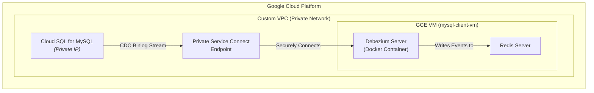

# GCP: Real-Time MySQL CDC to Redis using Debezium Server

This project provisions a real-time Change Data Capture (CDC) pipeline on Google Cloud Platform using Terraform.

It automates the deployment of a private Cloud SQL for MySQL instance and a GCE VM. The GCE VM runs a Debezium Server container, which captures data changes from MySQL and streams them into a Redis instance running on the same VM.

This architecture provides a secure, self-contained environment for real-time data capture and caching within a private VPC.

## Architecture Diagram

The current architecture consists of the following flow:

**Cloud SQL (MySQL) -> GCE VM (Debezium Server + Redis) -> Redis Streams**



## Architecture Components

1.  **VPC & Subnets**: A custom VPC is created with a private subnet to host the cloud resources securely.
2.  **Cloud SQL for MySQL**: A private instance acts as the transactional database source. It has **no public IP** and is not directly exposed to the internet.
3.  **Private Service Connect (PSC)**: A PSC endpoint is created to provide a stable, private IP address for the Cloud SQL instance, allowing services within the VPC to connect to it securely.
4.  **GCE Client VM (`mysql-client-vm`)**: A Debian VM is provisioned in the private subnet. Its startup script automatically installs:
    *   **MySQL Client**: For direct database interaction.
    *   **Redis Server**: To act as the sink (destination) for CDC events.
    *   **Docker Engine**: To run the Debezium Server.
5.  **Google Cloud Storage (GCS)**: A temporary GCS bucket is used during the provisioning process to copy local `debezium-server` configuration files to the GCE VM. This bucket is automatically created and deleted by Terraform.
6.  **Debezium Server**: Runs as a Docker container on the GCE VM. It connects to the Cloud SQL instance via its PSC endpoint and streams all data changes to the local Redis server.

## Prerequisites

1.  **Terraform**: Version v1.0 or later installed.
2.  **Google Cloud SDK**: `gcloud` CLI installed and authenticated.
3.  **GCP Project**: A Google Cloud project with billing enabled.
4.  **APIs**: The Service Usage API (`serviceusage.googleapis.com`) should be enabled. The Terraform code will enable the rest of the required APIs.
5.  **Terraform State Bucket**: You must create a GCS bucket beforehand to store the Terraform state files.
    ```sh
    gsutil mb -p <YOUR_GCP_PROJECT_ID> gs://tfstate-<YOUR_GCP_PROJECT_ID>
    gsutil versioning set on gs://tfstate-<YOUR_GCP_PROJECT_ID>
    ```
6.  **Set IAM Permissions for Terraform**:
    The Compute Engine default service account, which Terraform may use for authentication, needs `Storage Admin` permissions to manage the state bucket.
    ```bash
    PROJECT_ID=$(gcloud config get-value project)
    PROJECT_NUMBER=$(gcloud projects describe $PROJECT_ID --format="value(projectNumber)")
    gcloud projects add-iam-policy-binding $(gcloud config get-value project) \
        --member="serviceAccount:${PROJECT_NUMBER}-compute@developer.gserviceaccount.com"
        --role="roles/storage.admin"
    ```

## Directory Structure

-   `terraform/environments/dev/`: The entrypoint for running Terraform commands.
-   `terraform/modules/`: Contains reusable infrastructure modules.
    -   `network/`: Provisions the VPC and subnets.
    -   `debezium-source/`: Provisions the Cloud SQL for MySQL instance and its PSC endpoint.
    -   `gce-client/`: Provisions the GCE VM (`mysql-client-vm`) with all necessary software.
-   `debezium-server/config/`: Contains the Debezium Server configuration files.

## Configuration

1.  **Update Backend Configuration**:
    In `terraform/environments/dev/main.tf`, update the `backend "gcs"` block with the name of your Terraform state bucket.

    ```terraform
    terraform {
      backend "gcs" {
        bucket = "tfstate-<YOUR_GCP_PROJECT_ID>" # <-- UPDATE THIS
        prefix = "gcp-debezium-mysql-cdc-to-redis/terraform"
      }
    }
    ```

2.  **Create a Variables File**:
    In the `terraform/environments/dev` directory, copy the example variables file.
    ```sh
    cp terraform.tfvars.example terraform.tfvars
    ```

3.  **Update `terraform.tfvars`**:
    Edit `terraform.tfvars` and replace the placeholder values, especially `project_id`.

4.  **Update Debezium Configuration**:
    Edit `debezium-server/config/application.properties.example` and save it as `application.properties`. Update the following properties to match your environment. The Terraform outputs will provide the required values after deployment.
    *   `debezium.source.database.hostname`: Set this to the `cloud_sql_psc_endpoint_ip` output.
    *   `debezium.source.database.user`: Set this to the `datastream_user_name` output.
    *   `debezium.source.database.password`: Set this to the `datastream_user_password` output.
    *   `debezium.sink.redis.address`: This will be the GCE VM's internal IP, but since Redis is on the same machine, you can often use `localhost:6379`.

## Deployment

1.  **Navigate to the environment directory**:
    ```sh
    cd terraform/environments/dev
    ```

2.  **Initialize Terraform**:
    ```sh
    terraform init
    ```

3.  **Plan and Apply**:
    Review the plan and apply the configuration.
    ```bash
    terraform plan
    terraform apply
    ```

## End-to-End Pipeline Verification

After deploying the infrastructure, follow these steps to configure the database, populate it with initial data, start the Debezium server, and verify that the pipeline is capturing changes correctly.

### Step 1: Grant SQL Permissions

First, you must connect to the Cloud SQL instance to grant the necessary permissions for CDC. The easiest way to perform this one-time setup is by using **Cloud SQL Studio** from the GCP Console.

#### a. Get Admin Password

Retrieve the generated admin password from the Terraform output. From the `terraform/environments/dev` directory, run:
```bash
terraform output admin_user_password
```

#### b. Connect via Cloud SQL Studio

1.  Open the [Cloud SQL instances page](https://console.cloud.google.com/sql/instances) in the GCP Console.
2.  Find your instance (e.g., `mysql-src-ds`) and click its name.
3.  From the left menu, select **"Cloud SQL Studio"**.
4.  Log in with the username `rdsadmin` and the password from the previous step. The database name is `testdb`.

#### c. Execute the GRANT Command

In the Cloud SQL Studio query editor, run the following SQL commands to grant the `datastream` user the required replication privileges:
```sql
GRANT REPLICATION SLAVE, SELECT, REPLICATION CLIENT ON *.* TO 'datastream'@'%';
FLUSH PRIVILEGES;
```

### Step 2: Generate and Insert Initial Data

Before starting Debezium, let\'s create a table and populate it with sample data. Debezium will perform an initial snapshot of this data when it first connects.

#### a. Navigate to the scripts directory

From your local machine (not the VM), go to the scripts directory:
```bash
# If you are in terraform/environments/dev
cd ../../../scripts 
```

#### b. Setup the Python environment

Follow the instructions in `scripts/README.md` to set up the `uv` virtual environment and install dependencies.

#### c. Generate SQL statements

This command will create a file named `sample_data.sql` containing the `CREATE TABLE` statement and 1000 `INSERT` statements.
```bash
uv run python generate_fake_sql.py --generate-ddl --max-count 1000 > sample_data.sql
```

#### d. Import the SQL data via Cloud SQL Studio

The simplest way to import the data is to use Cloud SQL Studio again.
1.  Connect to your database in Cloud SQL Studio as described in **Step 1**.
2.  Open the `sample_data.sql` file in a text editor and copy its contents.
3.  Paste the SQL into the query editor and click **"Run"**.

### Step 3: Start the Debezium Server

Now that the source database is ready, connect to the GCE VM to configure and start the Debezium Server.

#### a. Connect to the GCE VM

Use the `gcloud` CLI to SSH into the VM via IAP.
```bash
gcloud compute ssh mysql-client-vm --zone=$(terraform output -raw gce_client_zone) --project=$(gcloud config get-value project)
```

#### b. Configure Docker Permissions
To avoid typing `sudo` for every `docker` command, you can add your user to the `docker` group.

1.  **Add the current user to the `docker` group:**
    ```bash
    sudo usermod -aG docker $USER
    ```

2.  **Apply the new group membership.** You can either log out and log back in, or run the following command to activate the changes for your current session:
    ```bash
    newgrp docker
    ```

#### c. Configure and Run Debezium

On the VM, prepare the configuration and start the Debezium Server Docker container.
```bash
# The config files were copied to /opt/debezium-server by the startup script
mkdir -p $HOME/config
sudo cp /opt/debezium-server/config/application.properties.example $HOME/config/application.properties
sudo chown -R $USER:root $HOME/config/

# IMPORTANT: Update application.properties with the correct values from terraform output
# You will need the 'cloud_sql_psc_endpoint_ip', 'datastream_user_name', and 'datastream_user_password'
vi $HOME/config/application.properties

# Run the Debezium server using the script provided
/opt/debezium-server/run_debezium_server.sh
```

You should see logs indicating that the container is starting and performing an initial snapshot.
<details>
<summary>Click to expand Debezium Server Logs</summary>
<pre>
    No existing container named 'debezium' found.
    Starting a new container named 'debezium'...

        __       __                 _
    ____/ /___   / /_   ___  ____   (_)__  __ ____ ___
    / __  // _ \ / __ \ / _ \/_  /  / // / / // __ `__ \
    / /_/ //  __// /_/ //  __/ / /_ / // /_/ // / / / / /
    \__,_/ \___//_.___/ \___/ /___//_/ \__,_//_/ /_/ /_/


                                Powered by Quarkus 3.8.5
    2025-08-31 06:11:30,240 INFO  [io.api.reg.res.JacksonDateTimeCustomizer] (main) ---------------------------------------------------------------------
    2025-08-31 06:11:30,240 INFO  [io.api.reg.res.JacksonDateTimeCustomizer] (main) Legacy REST API date formats enabled (this is currently the default).
    2025-08-31 06:11:30,240 INFO  [io.api.reg.res.JacksonDateTimeCustomizer] (main)
    2025-08-31 06:11:30,240 INFO  [io.api.reg.res.JacksonDateTimeCustomizer] (main) For maximum compatibility and to ease upgrades from older versions
    2025-08-31 06:11:30,240 INFO  [io.api.reg.res.JacksonDateTimeCustomizer] (main) of Registry, the date format used in the REST API is not compliant
    2025-08-31 06:11:30,240 INFO  [io.api.reg.res.JacksonDateTimeCustomizer] (main) with OpenAPI standards (due to a bug in older versions).  Please
    2025-08-31 06:11:30,240 INFO  [io.api.reg.res.JacksonDateTimeCustomizer] (main) make sure you upgrade all of your client applications to use the
    2025-08-31 06:11:30,240 INFO  [io.api.reg.res.JacksonDateTimeCustomizer] (main) latest client version.  The next release will fix the date format
    2025-08-31 06:11:30,240 INFO  [io.api.reg.res.JacksonDateTimeCustomizer] (main) bug, which will result in older clients no longer being compatible
    2025-08-31 06:11:30,240 INFO  [io.api.reg.res.JacksonDateTimeCustomizer] (main) with the REST API.
    2025-08-31 06:11:30,240 INFO  [io.api.reg.res.JacksonDateTimeCustomizer] (main)
    2025-08-31 06:11:30,240 INFO  [io.api.reg.res.JacksonDateTimeCustomizer] (main) If you would like to fix the date format bug in THIS version of
    2025-08-31 06:11:30,240 INFO  [io.api.reg.res.JacksonDateTimeCustomizer] (main) Registry (great!) please set the following ENV variable + value:
    2025-08-31 06:11:30,240 INFO  [io.api.reg.res.JacksonDateTimeCustomizer] (main)
    2025-08-31 06:11:30,240 INFO  [io.api.reg.res.JacksonDateTimeCustomizer] (main) REGISTRY_APIS_V2_DATE_FORMAT=yyyy-MM-dd'T'HH:mm:ss'Z'
    2025-08-31 06:11:30,240 INFO  [io.api.reg.res.JacksonDateTimeCustomizer] (main)
    2025-08-31 06:11:30,240 INFO  [io.api.reg.res.JacksonDateTimeCustomizer] (main) Doing this will result in a REST API that is OpenAPI compliant, but
    2025-08-31 06:11:30,240 INFO  [io.api.reg.res.JacksonDateTimeCustomizer] (main) please remember to upgrade all your client applications first!
    2025-08-31 06:11:30,240 INFO  [io.api.reg.res.JacksonDateTimeCustomizer] (main) ---------------------------------------------------------------------
    2025-08-31 06:11:32,498 INFO  [io.deb.ser.BaseChangeConsumer] (main) Using 'io.debezium.server.BaseChangeConsumer$Lambda/0x00007f898839c968@3e8b3b79' stream name mapper
    2025-08-31 06:11:32,722 INFO  [io.deb.sto.red.RedisCommonConfig] (main) Configuration for 'RedisStreamChangeConsumerConfig' with prefix 'debezium.sink.': {redis.memory.threshold.percentage=0, type=redis, redis.address=redis_host:6379}
    2025-08-31 06:11:33,211 INFO  [io.deb.sto.red.RedisConnection] (main) Using Redis client 'JedisClient [jedis=Jedis{Connection{DefaultJedisSocketFactory{redis_host:6379}}}]'
    2025-08-31 06:11:33,214 INFO  [io.deb.ser.DebeziumServer] (main) Consumer 'io.debezium.server.redis.RedisStreamChangeConsumer' instantiated
    2025-08-31 06:11:33,506 INFO  [org.apa.kaf.con.jso.JsonConverterConfig] (main) JsonConverterConfig values:
        converter.type = header
        decimal.format = BASE64
        replace.null.with.default = true
        schemas.cache.size = 1000
        schemas.enable = true

    2025-08-31 06:11:33,509 INFO  [org.apa.kaf.con.jso.JsonConverterConfig] (main) JsonConverterConfig values:
        converter.type = key
        decimal.format = BASE64
        replace.null.with.default = true
        schemas.cache.size = 1000
        schemas.enable = true

    2025-08-31 06:11:33,516 INFO  [org.apa.kaf.con.jso.JsonConverterConfig] (main) JsonConverterConfig values:
        converter.type = value
        decimal.format = BASE64
        replace.null.with.default = true
        schemas.cache.size = 1000
        schemas.enable = true

    2025-08-31 06:11:33,654 INFO  [io.deb.emb.EmbeddedWorkerConfig] (main) EmbeddedWorkerConfig values:
        access.control.allow.methods =
        access.control.allow.origin =
        admin.listeners = null
        auto.include.jmx.reporter = true
        bootstrap.servers = [localhost:9092]
        client.dns.lookup = use_all_dns_ips
        config.providers = []
        connector.client.config.override.policy = All
        header.converter = class org.apache.kafka.connect.storage.SimpleHeaderConverter
        key.converter = class org.apache.kafka.connect.json.JsonConverter
        listeners = [http://:8083]
        metric.reporters = []
        metrics.num.samples = 2
        metrics.recording.level = INFO
        metrics.sample.window.ms = 30000
        offset.flush.interval.ms = 60000
        offset.flush.timeout.ms = 5000
        offset.storage.file.filename =
        offset.storage.partitions = null
        offset.storage.replication.factor = null
        offset.storage.topic =
        plugin.discovery = hybrid_warn
        plugin.path = null
        response.http.headers.config =
        rest.advertised.host.name = null
        rest.advertised.listener = null
        rest.advertised.port = null
        rest.extension.classes = []
        ssl.cipher.suites = null
        ssl.client.auth = none
        ssl.enabled.protocols = [TLSv1.2, TLSv1.3]
        ssl.endpoint.identification.algorithm = https
        ssl.engine.factory.class = null
        ssl.key.password = null
        ssl.keymanager.algorithm = SunX509
        ssl.keystore.certificate.chain = null
        ssl.keystore.key = null
        ssl.keystore.location = null
        ssl.keystore.password = null
        ssl.keystore.type = JKS
        ssl.protocol = TLSv1.3
        ssl.provider = null
        ssl.secure.random.implementation = null
        ssl.trustmanager.algorithm = PKIX
        ssl.truststore.certificates = null
        ssl.truststore.location = null
        ssl.truststore.password = null
        ssl.truststore.type = JKS
        task.shutdown.graceful.timeout.ms = 5000
        topic.creation.enable = true
        topic.tracking.allow.reset = true
        topic.tracking.enable = true
        value.converter = class org.apache.kafka.connect.json.JsonConverter

    2025-08-31 06:11:33,728 INFO  [org.apa.kaf.con.jso.JsonConverterConfig] (main) JsonConverterConfig values:
        converter.type = key
        decimal.format = BASE64
        replace.null.with.default = true
        schemas.cache.size = 1000
        schemas.enable = false

    2025-08-31 06:11:33,734 INFO  [org.apa.kaf.con.jso.JsonConverterConfig] (main) JsonConverterConfig values:
        converter.type = value
        decimal.format = BASE64
        replace.null.with.default = true
        schemas.cache.size = 1000
        schemas.enable = false

    2025-08-31 06:11:33,741 INFO  [io.deb.ser.DebeziumServer] (main) Engine executor started
    2025-08-31 06:11:33,751 INFO  [io.deb.emb.asy.AsyncEmbeddedEngine] (pool-7-thread-1) Engine state has changed from 'CREATING' to 'INITIALIZING'
    2025-08-31 06:11:34,017 INFO  [io.deb.con.CommonConnectorConfig] (pool-7-thread-1) Loading the custom source info struct maker plugin: io.debezium.connector.mysql.MySqlSourceInfoStructMaker
    2025-08-31 06:11:34,222 INFO  [io.quarkus] (main) debezium-server-dist 3.0.0.Final on JVM (powered by Quarkus 3.8.5) started in 6.558s. Listening on: http://0.0.0.0:8080
    2025-08-31 06:11:34,226 INFO  [io.quarkus] (main) Profile prod activated.
    2025-08-31 06:11:34,227 INFO  [io.quarkus] (main) Installed features: [cdi, kubernetes-client, resteasy, resteasy-jackson, smallrye-context-propagation, smallrye-health, vertx]
    2025-08-31 06:11:35,774 INFO  [io.deb.con.mys.jdb.MySqlConnection] (pool-7-thread-1) Using 'SHOW MASTER STATUS' to get binary log status
    2025-08-31 06:11:35,795 INFO  [io.deb.con.bin.BinlogConnector] (pool-7-thread-1) Successfully tested connection for jdbc:mysql://10.1.0.2:3306/?useInformationSchema=true&nullCatalogMeansCurrent=false&useUnicode=true&characterEncoding=UTF-8&characterSetResults=UTF-8&zeroDateTimeBehavior=CONVERT_TO_NULL&connectTimeout=30000 with user 'datastream'
    2025-08-31 06:11:35,804 INFO  [io.deb.jdb.JdbcConnection] (pool-10-thread-1) Connection gracefully closed
    2025-08-31 06:11:35,853 WARN  [io.deb.ser.red.RedisOffsetBackingStore] (pool-7-thread-1) Class 'io.debezium.server.redis.RedisOffsetBackingStore' is deprecated and scheduled for removal, please use 'io.debezium.storage.redis.offset.RedisOffsetBackingStore'
    2025-08-31 06:11:35,854 INFO  [io.deb.sto.red.RedisCommonConfig] (pool-7-thread-1) Configuration for 'RedisOffsetBackingStoreConfig' with prefix 'offset.storage.': {redis.memory.threshold.percentage=0, redis.address=redis_host:6379, file.filename=}
    2025-08-31 06:11:35,857 INFO  [io.deb.sto.red.off.RedisOffsetBackingStore] (pool-7-thread-1) Starting RedisOffsetBackingStore
    2025-08-31 06:11:35,859 INFO  [io.deb.sto.red.RedisConnection] (pool-7-thread-1) Using Redis client 'JedisClient [jedis=Jedis{Connection{DefaultJedisSocketFactory{redis_host:6379}}}]'
    2025-08-31 06:11:36,018 INFO  [io.deb.sto.red.off.RedisOffsetBackingStore] (pool-7-thread-1) Offsets: {  }
    2025-08-31 06:11:36,062 INFO  [io.deb.emb.asy.AsyncEmbeddedEngine] (pool-7-thread-1) Engine state has changed from 'INITIALIZING' to 'CREATING_TASKS'
    2025-08-31 06:11:36,113 INFO  [io.deb.emb.asy.AsyncEmbeddedEngine] (pool-7-thread-1) Engine state has changed from 'CREATING_TASKS' to 'STARTING_TASKS'
    2025-08-31 06:11:36,117 INFO  [io.deb.emb.asy.AsyncEmbeddedEngine] (pool-7-thread-1) Waiting max. for 180000 ms for individual source tasks to start.
    2025-08-31 06:11:36,120 INFO  [io.deb.con.com.BaseSourceTask] (pool-8-thread-1) Starting MySqlConnectorTask with configuration:
    2025-08-31 06:11:36,122 INFO  [io.deb.con.com.BaseSourceTask] (pool-8-thread-1)    connector.class = io.debezium.connector.mysql.MySqlConnector
    2025-08-31 06:11:36,123 INFO  [io.deb.con.com.BaseSourceTask] (pool-8-thread-1)    record.processing.shutdown.timeout.ms = 1000
    2025-08-31 06:11:36,123 INFO  [io.deb.con.com.BaseSourceTask] (pool-8-thread-1)    schema.history.internal.redis.memory.threshold.percentage = 0
    2025-08-31 06:11:36,124 INFO  [io.deb.con.com.BaseSourceTask] (pool-8-thread-1)    record.processing.order = ORDERED
    2025-08-31 06:11:36,124 INFO  [io.deb.con.com.BaseSourceTask] (pool-8-thread-1)    topic.prefix = tutorial
    2025-08-31 06:11:36,125 INFO  [io.deb.con.com.BaseSourceTask] (pool-8-thread-1)    offset.storage.redis.address = redis_host:6379
    2025-08-31 06:11:36,125 INFO  [io.deb.con.com.BaseSourceTask] (pool-8-thread-1)    offset.storage.file.filename =
    2025-08-31 06:11:36,126 INFO  [io.deb.con.com.BaseSourceTask] (pool-8-thread-1)    record.processing.threads =
    2025-08-31 06:11:36,128 INFO  [io.deb.con.com.BaseSourceTask] (pool-8-thread-1)    errors.retry.delay.initial.ms = 300
    2025-08-31 06:11:36,129 INFO  [io.deb.con.com.BaseSourceTask] (pool-8-thread-1)    value.converter = org.apache.kafka.connect.json.JsonConverter
    2025-08-31 06:11:36,129 INFO  [io.deb.con.com.BaseSourceTask] (pool-8-thread-1)    key.converter = org.apache.kafka.connect.json.JsonConverter
    2025-08-31 06:11:36,129 INFO  [io.deb.con.com.BaseSourceTask] (pool-8-thread-1)    schema.history.internal.redis.address = redis_host:6379
    2025-08-31 06:11:36,131 INFO  [io.deb.con.com.BaseSourceTask] (pool-8-thread-1)    database.user = datastream
    2025-08-31 06:11:36,131 INFO  [io.deb.con.com.BaseSourceTask] (pool-8-thread-1)    database.dbname = testdb
    2025-08-31 06:11:36,131 INFO  [io.deb.con.com.BaseSourceTask] (pool-8-thread-1)    database.server.id = 1234
    2025-08-31 06:11:36,132 INFO  [io.deb.con.com.BaseSourceTask] (pool-8-thread-1)    offset.storage = io.debezium.server.redis.RedisOffsetBackingStore
    2025-08-31 06:11:36,132 INFO  [io.deb.con.com.BaseSourceTask] (pool-8-thread-1)    database.server.name = mysql-src-ds
    2025-08-31 06:11:36,135 INFO  [io.deb.con.com.BaseSourceTask] (pool-8-thread-1)    offset.flush.timeout.ms = 5000
    2025-08-31 06:11:36,136 INFO  [io.deb.con.com.BaseSourceTask] (pool-8-thread-1)    errors.retry.delay.max.ms = 10000
    2025-08-31 06:11:36,136 INFO  [io.deb.con.com.BaseSourceTask] (pool-8-thread-1)    database.port = 3306
    2025-08-31 06:11:36,139 INFO  [io.deb.con.com.BaseSourceTask] (pool-8-thread-1)    offset.storage.redis.memory.threshold.percentage = 0
    2025-08-31 06:11:36,140 INFO  [io.deb.con.com.BaseSourceTask] (pool-8-thread-1)    offset.flush.interval.ms = 60000
    2025-08-31 06:11:36,141 INFO  [io.deb.con.com.BaseSourceTask] (pool-8-thread-1)    internal.task.management.timeout.ms = 180000
    2025-08-31 06:11:36,141 INFO  [io.deb.con.com.BaseSourceTask] (pool-8-thread-1)    schema.history.internal = io.debezium.storage.redis.history.RedisSchemaHistory
    2025-08-31 06:11:36,142 INFO  [io.deb.con.com.BaseSourceTask] (pool-8-thread-1)    record.processing.with.serial.consumer = false
    2025-08-31 06:11:36,144 INFO  [io.deb.con.com.BaseSourceTask] (pool-8-thread-1)    errors.max.retries = -1
    2025-08-31 06:11:36,145 INFO  [io.deb.con.com.BaseSourceTask] (pool-8-thread-1)    database.hostname = 10.1.0.2
    2025-08-31 06:11:36,145 INFO  [io.deb.con.com.BaseSourceTask] (pool-8-thread-1)    database.password = ********
    2025-08-31 06:11:36,146 INFO  [io.deb.con.com.BaseSourceTask] (pool-8-thread-1)    name = redis
    2025-08-31 06:11:36,147 INFO  [io.deb.con.CommonConnectorConfig] (pool-8-thread-1) Loading the custom source info struct maker plugin: io.debezium.connector.mysql.MySqlSourceInfoStructMaker
    2025-08-31 06:11:36,152 INFO  [io.deb.con.CommonConnectorConfig] (pool-8-thread-1) Loading the custom topic naming strategy plugin: io.debezium.schema.DefaultTopicNamingStrategy
    2025-08-31 06:11:36,259 INFO  [io.deb.con.mys.jdb.MySqlConnection] (pool-8-thread-1) Using 'SHOW MASTER STATUS' to get binary log status
    2025-08-31 06:11:36,299 INFO  [io.deb.con.com.BaseSourceTask] (pool-8-thread-1) No previous offsets found
    2025-08-31 06:11:36,469 INFO  [io.deb.sto.red.RedisCommonConfig] (pool-8-thread-1) Configuration for 'RedisSchemaHistoryConfig' with prefix 'schema.history.internal.': {connector.class=io.debezium.connector.mysql.MySqlConnector, redis.memory.threshold.percentage=0, name=tutorial-schemahistory, connector.id=tutorial, redis.address=redis_host:6379}
    2025-08-31 06:11:37,114 INFO  [io.deb.sto.red.his.RedisSchemaHistory] (pool-8-thread-1) Starting RedisSchemaHistory
    2025-08-31 06:11:37,118 INFO  [io.deb.sto.red.RedisConnection] (pool-8-thread-1) Using Redis client 'JedisClient [jedis=Jedis{Connection{DefaultJedisSocketFactory{redis_host:6379}}}]'
    2025-08-31 06:11:37,366 INFO  [io.deb.con.mys.jdb.MySqlConnection] (pool-8-thread-1) Using 'SHOW MASTER STATUS' to get binary log status
    2025-08-31 06:11:37,672 INFO  [io.deb.con.mys.MySqlConnectorTask] (pool-8-thread-1) Closing connection before starting schema recovery
    2025-08-31 06:11:37,675 INFO  [io.deb.jdb.JdbcConnection] (pool-11-thread-1) Connection gracefully closed
    2025-08-31 06:11:37,677 INFO  [io.deb.con.com.BaseSourceTask] (pool-8-thread-1) Connector started for the first time.
    2025-08-31 06:11:37,677 INFO  [io.deb.con.mys.MySqlConnectorTask] (pool-8-thread-1) Reconnecting after finishing schema recovery
    2025-08-31 06:11:37,714 INFO  [io.deb.con.mys.MySqlConnectorTask] (pool-8-thread-1) No previous offset found
    2025-08-31 06:11:37,856 INFO  [io.deb.uti.Threads] (pool-8-thread-1) Requested thread factory for component MySqlConnector, id = tutorial named = SignalProcessor
    2025-08-31 06:11:37,895 INFO  [io.deb.uti.Threads] (pool-8-thread-1) Requested thread factory for component MySqlConnector, id = tutorial named = change-event-source-coordinator
    2025-08-31 06:11:37,897 INFO  [io.deb.uti.Threads] (pool-8-thread-1) Requested thread factory for component MySqlConnector, id = tutorial named = blocking-snapshot
    2025-08-31 06:11:37,904 INFO  [io.deb.uti.Threads] (pool-8-thread-1) Creating thread debezium-mysqlconnector-tutorial-change-event-source-coordinator
    2025-08-31 06:11:37,907 INFO  [io.deb.emb.asy.AsyncEmbeddedEngine] (pool-7-thread-1) All tasks have started successfully.
    2025-08-31 06:11:37,909 INFO  [io.deb.emb.asy.AsyncEmbeddedEngine] (pool-7-thread-1) Engine state has changed from 'STARTING_TASKS' to 'POLLING_TASKS'
    2025-08-31 06:11:37,912 INFO  [io.deb.emb.asy.AsyncEmbeddedEngine] (pool-7-thread-1) Using io.debezium.embedded.async.ParallelSmtAndConvertBatchProcessor processor
    2025-08-31 06:11:37,933 INFO  [io.deb.pip.ChangeEventSourceCoordinator] (debezium-mysqlconnector-tutorial-change-event-source-coordinator) Metrics registered
    2025-08-31 06:11:37,936 INFO  [io.deb.pip.ChangeEventSourceCoordinator] (debezium-mysqlconnector-tutorial-change-event-source-coordinator) Context created
    2025-08-31 06:11:37,978 INFO  [io.deb.rel.RelationalSnapshotChangeEventSource] (debezium-mysqlconnector-tutorial-change-event-source-coordinator) According to the connector configuration both schema and data will be snapshot.
    2025-08-31 06:11:37,984 INFO  [io.deb.rel.RelationalSnapshotChangeEventSource] (debezium-mysqlconnector-tutorial-change-event-source-coordinator) Snapshot step 1 - Preparing
    2025-08-31 06:11:37,990 INFO  [io.deb.rel.RelationalSnapshotChangeEventSource] (debezium-mysqlconnector-tutorial-change-event-source-coordinator) Snapshot step 2 - Determining captured tables
    2025-08-31 06:11:37,992 INFO  [io.deb.con.bin.BinlogSnapshotChangeEventSource] (debezium-mysqlconnector-tutorial-change-event-source-coordinator) Read list of available databases
    2025-08-31 06:11:37,998 INFO  [io.deb.con.bin.BinlogSnapshotChangeEventSource] (debezium-mysqlconnector-tutorial-change-event-source-coordinator) </ul>list of available databases is: [information_schema, mysql, performance_schema, sys, testdb]
    2025-08-31 06:11:38,002 INFO  [io.deb.con.bin.BinlogSnapshotChangeEventSource] (debezium-mysqlconnector-tutorial-change-event-source-coordinator) Read list of available tables in each database
    2025-08-31 06:11:38,033 INFO  [io.deb.con.bin.BinlogSnapshotChangeEventSource] (debezium-mysqlconnector-tutorial-change-event-source-coordinator) </ul>snapshot continuing with database(s): [information_schema, performance_schema, testdb, mysql, sys]
    2025-08-31 06:11:38,036 INFO  [io.deb.rel.RelationalSnapshotChangeEventSource] (debezium-mysqlconnector-tutorial-change-event-source-coordinator) Adding table testdb.retail_trans to the list of capture schema tables
    2025-08-31 06:11:38,042 INFO  [io.deb.rel.RelationalSnapshotChangeEventSource] (debezium-mysqlconnector-tutorial-change-event-source-coordinator) Created connection pool with 1 threads
    2025-08-31 06:11:38,044 INFO  [io.deb.rel.RelationalSnapshotChangeEventSource] (debezium-mysqlconnector-tutorial-change-event-source-coordinator) Snapshot step 3 - Locking captured tables [testdb.retail_trans]
    2025-08-31 06:11:38,062 INFO  [io.deb.con.bin.BinlogSnapshotChangeEventSource] (debezium-mysqlconnector-tutorial-change-event-source-coordinator) Flush and obtain global read lock to prevent writes to database
    2025-08-31 06:11:38,075 INFO  [io.deb.rel.RelationalSnapshotChangeEventSource] (debezium-mysqlconnector-tutorial-change-event-source-coordinator) Snapshot step 4 - Determining snapshot offset
    2025-08-31 06:11:38,086 INFO  [io.deb.con.mys.MySqlSnapshotChangeEventSource] (debezium-mysqlconnector-tutorial-change-event-source-coordinator) Read binlog position of MySQL primary server
    2025-08-31 06:11:38,093 INFO  [io.deb.con.mys.MySqlSnapshotChangeEventSource] (debezium-mysqlconnector-tutorial-change-event-source-coordinator) </ul> using binlog 'mysql-bin.000003' at position '197' and gtid '71f58f31-8423-11f0-9a79-42010a670002:1-128'
    2025-08-31 06:11:38,095 INFO  [io.deb.rel.RelationalSnapshotChangeEventSource] (debezium-mysqlconnector-tutorial-change-event-source-coordinator) Snapshot step 5 - Reading structure of captured tables
    2025-08-31 06:11:38,098 INFO  [io.deb.con.bin.BinlogSnapshotChangeEventSource] (debezium-mysqlconnector-tutorial-change-event-source-coordinator) All eligible tables schema should be captured, capturing: [testdb.retail_trans]
    ANTLR Tool version 4.10.1 used for code generation does not match the current runtime version 4.13.0
    ANTLR Runtime version 4.10.1 used for parser compilation does not match the current runtime version 4.13.0
    ANTLR Tool version 4.10.1 used for code generation does not match the current runtime version 4.13.0
    ANTLR Runtime version 4.10.1 used for parser compilation does not match the current runtime version 4.13.0
    2025-08-31 06:11:39,880 INFO  [io.deb.con.bin.BinlogSnapshotChangeEventSource] (debezium-mysqlconnector-tutorial-change-event-source-coordinator) Reading structure of database 'testdb'
    2025-08-31 06:11:40,182 INFO  [io.deb.rel.RelationalSnapshotChangeEventSource] (debezium-mysqlconnector-tutorial-change-event-source-coordinator) Snapshot step 6 - Persisting schema history
    2025-08-31 06:11:40,207 INFO  [io.deb.rel.his.SchemaHistoryMetrics] (debezium-mysqlconnector-tutorial-change-event-source-coordinator) Already applied 1 database changes
    2025-08-31 06:11:40,300 INFO  [io.deb.con.bin.BinlogSnapshotChangeEventSource] (debezium-mysqlconnector-tutorial-change-event-source-coordinator) Releasing global read lock to enable MySQL writes
    2025-08-31 06:11:40,303 INFO  [io.deb.con.bin.BinlogSnapshotChangeEventSource] (debezium-mysqlconnector-tutorial-change-event-source-coordinator) Writes to MySQL tables prevented for a total of 00:00:02.23
    2025-08-31 06:11:40,305 INFO  [io.deb.rel.RelationalSnapshotChangeEventSource] (debezium-mysqlconnector-tutorial-change-event-source-coordinator) Snapshot step 7 - Snapshotting data
    2025-08-31 06:11:40,308 INFO  [io.deb.rel.RelationalSnapshotChangeEventSource] (debezium-mysqlconnector-tutorial-change-event-source-coordinator) Creating snapshot worker pool with 1 worker thread(s)
    2025-08-31 06:11:40,313 INFO  [io.deb.rel.RelationalSnapshotChangeEventSource] (debezium-mysqlconnector-tutorial-change-event-source-coordinator) For table 'testdb.retail_trans' using select statement: 'SELECT `trans_id`, `customer_id`, `event`, `sku`, `amount`, `device`, `trans_datetime` FROM `testdb`.`retail_trans`'
    2025-08-31 06:11:40,332 INFO  [io.deb.con.bin.BinlogSnapshotChangeEventSource] (debezium-mysqlconnector-tutorial-change-event-source-coordinator) Estimated row count for table testdb.retail_trans is OptionalLong[100]
    2025-08-31 06:11:40,339 INFO  [io.deb.rel.RelationalSnapshotChangeEventSource] (pool-12-thread-1) Exporting data from table 'testdb.retail_trans' (1 of 1 tables)
    2025-08-31 06:11:40,466 INFO  [io.deb.rel.RelationalSnapshotChangeEventSource] (pool-12-thread-1) </ul> Finished exporting 110 records for table 'testdb.retail_trans' (1 of 1 tables); total duration '00:00:00.127'
    2025-08-31 06:11:40,478 INFO  [io.deb.pip.sou.AbstractSnapshotChangeEventSource] (debezium-mysqlconnector-tutorial-change-event-source-coordinator) Snapshot - Final stage
    2025-08-31 06:11:40,479 INFO  [io.deb.pip.sou.AbstractSnapshotChangeEventSource] (debezium-mysqlconnector-tutorial-change-event-source-coordinator) Snapshot completed
    2025-08-31 06:11:40,572 INFO  [io.deb.pip.ChangeEventSourceCoordinator] (debezium-mysqlconnector-tutorial-change-event-source-coordinator) Snapshot ended with SnapshotResult [status=COMPLETED, offset=BinlogOffsetContext{sourceInfoSchema=Schema{io.debezium.connector.mysql.Source:STRUCT}, sourceInfo=BinlogSourceInfo{currentGtid='null', currentBinlogFilename='mysql-bin.000003', currentBinlogPosition=197, currentRowNumber=0, serverId=0, sourceTime=2025-08-31T06:11:40Z, threadId=-1, currentQuery='null', tableIds=[testdb.retail_trans], databaseName='testdb'}, snapshotCompleted=true, transactionContext=TransactionContext [currentTransactionId=null, perTableEventCount={}, totalEventCount=0], restartGtidSet='71f58f31-8423-11f0-9a79-42010a670002:1-128', currentGtidSet='71f58f31-8423-11f0-9a79-42010a670002:1-128', restartBinlogFilename='mysql-bin.000003', restartBinlogPosition=197, restartRowsToSkip=0, restartEventsToSkip=0, currentEventLengthInBytes=0, inTransaction=false, transactionId='null', incrementalSnapshotContext=IncrementalSnapshotContext [windowOpened=false, chunkEndPosition=null, dataCollectionsToSnapshot=[], lastEventKeySent=null, maximumKey=null]}]
    2025-08-31 06:11:40,611 INFO  [io.deb.uti.Threads] (debezium-mysqlconnector-tutorial-change-event-source-coordinator) Requested thread factory for component MySqlConnector, id = tutorial named = binlog-client
    2025-08-31 06:11:40,619 INFO  [io.deb.con.bin.BinlogStreamingChangeEventSource] (debezium-mysqlconnector-tutorial-change-event-source-coordinator) Enable ssl PREFERRED mode for connector tutorial
    2025-08-31 06:11:40,684 INFO  [io.deb.pip.sig.SignalProcessor] (debezium-mysqlconnector-tutorial-change-event-source-coordinator) SignalProcessor started. Scheduling it every 5000ms
    2025-08-31 06:11:40,685 INFO  [io.deb.uti.Threads] (debezium-mysqlconnector-tutorial-change-event-source-coordinator) Creating thread debezium-mysqlconnector-tutorial-SignalProcessor
    2025-08-31 06:11:40,686 INFO  [io.deb.pip.ChangeEventSourceCoordinator] (debezium-mysqlconnector-tutorial-change-event-source-coordinator) Starting streaming
    2025-08-31 06:11:40,711 INFO  [io.deb.con.bin.BinlogStreamingChangeEventSource] (debezium-mysqlconnector-tutorial-change-event-source-coordinator) GTID set purged on server: ''
    2025-08-31 06:11:40,711 INFO  [io.deb.con.mys.jdb.MySqlConnection] (debezium-mysqlconnector-tutorial-change-event-source-coordinator) Attempting to generate a filtered GTID set
    2025-08-31 06:11:40,711 INFO  [io.deb.con.mys.jdb.MySqlConnection] (debezium-mysqlconnector-tutorial-change-event-source-coordinator) GTID set from previous recorded offset: 71f58f31-8423-11f0-9a79-42010a670002:1-128
    2025-08-31 06:11:40,712 INFO  [io.deb.con.mys.jdb.MySqlConnection] (debezium-mysqlconnector-tutorial-change-event-source-coordinator) GTID set available on server: 71f58f31-8423-11f0-9a79-42010a670002:1-128
    2025-08-31 06:11:40,713 INFO  [io.deb.con.mys.jdb.MySqlConnection] (debezium-mysqlconnector-tutorial-change-event-source-coordinator) Using first available positions for new GTID channels
    2025-08-31 06:11:40,713 INFO  [io.deb.con.mys.jdb.MySqlConnection] (debezium-mysqlconnector-tutorial-change-event-source-coordinator) Relevant GTID set available on server: 71f58f31-8423-11f0-9a79-42010a670002:1-128
    2025-08-31 06:11:40,716 INFO  [io.deb.con.mys.jdb.MySqlConnection] (debezium-mysqlconnector-tutorial-change-event-source-coordinator) Final merged GTID set to use when connecting to MySQL: 71f58f31-8423-11f0-9a79-42010a670002:1-128
    2025-08-31 06:11:40,716 INFO  [io.deb.con.bin.BinlogStreamingChangeEventSource] (debezium-mysqlconnector-tutorial-change-event-source-coordinator) Registering binlog reader with GTID set: '71f58f31-8423-11f0-9a79-42010a670002:1-128'
    2025-08-31 06:11:40,721 INFO  [io.deb.con.bin.BinlogStreamingChangeEventSource] (debezium-mysqlconnector-tutorial-change-event-source-coordinator) Skip 0 events on streaming start
    2025-08-31 06:11:40,723 INFO  [io.deb.con.bin.BinlogStreamingChangeEventSource] (debezium-mysqlconnector-tutorial-change-event-source-coordinator) Skip 0 rows on streaming start
    2025-08-31 06:11:40,725 INFO  [io.deb.uti.Threads] (debezium-mysqlconnector-tutorial-change-event-source-coordinator) Creating thread debezium-mysqlconnector-tutorial-binlog-client
    2025-08-31 06:11:40,733 INFO  [io.deb.uti.Threads] (blc-10.1.0.2:3306) Creating thread debezium-mysqlconnector-tutorial-binlog-client
    2025-08-31 06:11:40,738 INFO  [com.git.shy.mys.bin.BinaryLogClient] (blc-10.1.0.2:3306) Database version: 8.0.41-google (major=8, minor=0, mariadb=false)
    2025-08-31 06:11:41,071 INFO  [com.git.shy.mys.bin.BinaryLogClient] (blc-10.1.0.2:3306) SSL enabled
    2025-08-31 06:11:41,090 INFO  [com.git.shy.mys.bin.BinaryLogClient] (blc-10.1.0.2:3306) Connected to 10.1.0.2:3306 at 71f58f31-8423-11f0-9a79-42010a670002:1-128 (sid:1234, cid:254269)
    2025-08-31 06:11:41,091 INFO  [io.deb.con.bin.BinlogStreamingChangeEventSource] (blc-10.1.0.2:3306) Connected to binlog at 10.1.0.2:3306, starting at BinlogOffsetContext{sourceInfoSchema=Schema{io.debezium.connector.mysql.Source:STRUCT}, sourceInfo=BinlogSourceInfo{currentGtid='null', currentBinlogFilename='mysql-bin.000003', currentBinlogPosition=197, currentRowNumber=0, serverId=0, sourceTime=2025-08-31T06:11:40Z, threadId=-1, currentQuery='null', tableIds=[testdb.retail_trans], databaseName='testdb'}, snapshotCompleted=true, transactionContext=TransactionContext [currentTransactionId=null, perTableEventCount={}, totalEventCount=0], restartGtidSet='71f58f31-8423-11f0-9a79-42010a670002:1-128', currentGtidSet='71f58f31-8423-11f0-9a79-42010a670002:1-128', restartBinlogFilename='mysql-bin.000003', restartBinlogPosition=197, restartRowsToSkip=0, restartEventsToSkip=0, currentEventLengthInBytes=0, inTransaction=false, transactionId='null', incrementalSnapshotContext=IncrementalSnapshotContext [windowOpened=false, chunkEndPosition=null, dataCollectionsToSnapshot=[], lastEventKeySent=null, maximumKey=null]}]
    2025-08-31 06:11:41,092 INFO  [io.deb.con.bin.BinlogStreamingChangeEventSource] (debezium-mysqlconnector-tutorial-change-event-source-coordinator) Waiting for keepalive thread to start
    2025-08-31 06:11:41,094 INFO  [io.deb.uti.Threads] (blc-10.1.0.2:3306) Creating thread debezium-mysqlconnector-tutorial-binlog-client
    2025-08-31 06:11:41,195 INFO  [io.deb.con.bin.BinlogStreamingChangeEventSource] (debezium-mysqlconnector-tutorial-change-event-source-coordinator) Keepalive thread is running
    2025-08-31 06:11:41,202 INFO  [io.deb.con.com.BaseSourceTask] (pool-8-thread-1) 116 records sent during previous 00:00:05.122, last recorded offset of {server=tutorial} partition is {ts_sec=1756620700, file=mysql-bin.000003, pos=197, gtids=71f58f31-8423-11f0-9a79-42010a670002:1-128}
</pre>
</details>

### Step 4: Verify Initial Snapshot and CDC Events in Redis

Finally, confirm that the initial snapshot and any subsequent CDC events have been captured in Redis. 

1.  **Open a new terminal** and SSH into the GCE VM again.
2.  Use the `redis-cli` to inspect the events captured in the Redis Stream. The stream\'s name follows this format: `{debezium.source.topic.prefix}.{debezium.source.database.dbname}.{table_name}`. These values are configured in your `application.properties` file.

    ```bash
    # On the VM
    redis-cli

    # In the redis-cli prompt, inspect the stream.
    # Replace 'tutorial.testdb.retail_trans' with your actual stream name.
    XRANGE tutorial.testdb.retail_trans - +
    ```
You should see a large number of messages corresponding to the 1000 records you inserted. This confirms that the initial snapshot was successful. You can now perform additional `INSERT`, `UPDATE`, or `DELETE` operations in Cloud SQL Studio and see the new events appear in the Redis stream in real-time.

## Cleanup

To avoid incurring ongoing charges, destroy the infrastructure when you are finished.

1.  **Navigate to the environment directory**:
    ```sh
    cd terraform/environments/dev
    ```

2.  **Destroy the resources**:
    Type `yes` when prompted.
    ```sh
    terraform destroy
    ```

## References

- [Debezium Server :: Debezium Documentation](https://debezium.io/documentation/reference/stable/operations/debezium-server.html)
- [GitHub - debezium/debezium-server](https://github.com/debezium/debezium-server)
- [Debezium Server to Cloud PubSub: A Kafka-less way to stream changes from databases](https://medium.com/nerd-for-tech/debezium-server-to-cloud-pubsub-a-kafka-less-way-to-stream-changes-from-databases-1d6edc97da40)
- [Docker Hub - debezium/server](https://hub.docker.com/r/debezium/server)
- [Debezium Architecture :: Debezium Documentation](https://debezium.io/documentation/reference/stable/architecture.html)
- [Debezium Management Platform :: Debezium Documentation](https://debezium.io/documentation/reference/stable/operations/debezium-platform.html)
- [MySQL Change Data Capture to BigQuery Template :: Google Cloud Dataflow](https://cloud.google.com/dataflow/docs/guides/templates/provided/mysql-change-data-capture-to-bigquery)
- [GitHub - memiiso/debezium-server-bigquery](https://github.com/memiiso/debezium-server-bigquery)
- [Debezium을 사용한 Cloud SQL to BigQuery CDC 파이프라인 구축](https://velog.io/@minbrok/Debezium%EC%9D%84-%EC%82%AC%EC%9A%A9%ED%95%9C-Cloud-SQL-to-BigQuery-CDC-%ED%8C%8C%EC%9D%B4%ED%94%84%EB%9D%BC%EC%9D%B8-%EA%B5%AC%EC%B6%95)
